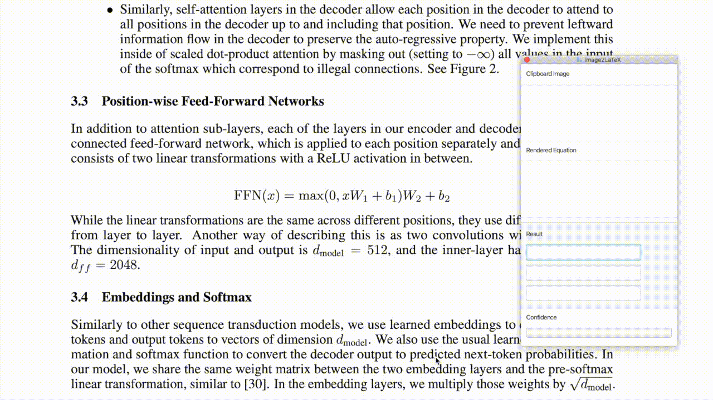

# Changes for JDK 11

To run Gradle in the IntelliJ IDE the following must be done:

* Use the right button on the top project node
  * `Open Module settings`
    * Set the JDK to version 11
  * In the same dialog box
    * Make sure the `Libraries` are all for JDK11
    * Make sure the `Project` JVM is set to JDK11
  * In the Gradle tab on the right
    * Select Gradle settings
      * Make sure the `Gradle JVM` is set to JDK 11

At this point you can use the IDE's Gradle-tool to run and execute the 
commands. However, it is not possible to:

* Execute the Gradle commands in the command line
* Execute the resulting application in the `ìmage2latex-mathpix/build/install/bin` 
directory. We get the following error: 

```
* What went wrong:
java.lang.UnsupportedClassVersionError: org/openjfx/gradle/JavaFXPlugin has been compiled by a more recent version of the Java Runtime (class file version 55.0), this version of the Java Runtime only recognizes class file versions up to 52.0
> org/openjfx/gradle/JavaFXPlugin has been compiled by a more recent version of the Java Runtime (class file version 55.0), this version of the Java Runtime only recognizes class file versions up to 52.0

* Try:
Run with --stacktrace option to get the stack trace. Run with --info or --debug option to get more log output. Run with --scan to get full insights.

* Get more help at https://help.gradle.org
```

The problem here is that [javafx-gradle-plugin](https://github.com/openjfx/javafx-gradle-plugin),
which is used to identify and download the javafx binaries (depending on the 
OS), was compiled for a more recent JDK. The above command will only work if 
the JDK is a version compatible with the minimum Gradle requirements. This is 
because the Gradle plugin's JDK version is greater that the OS JDK. If we had 
a JDK greater that the plugin's JDK version, we would be assured binary 
compatibility. 
    
Before setting up Gradle to use the correct lets see how we can determine 
were the OS has placed the JDK. The for command lists the JDKs that are 
available in the system:

```
user@machine:~$ update-alternatives --list java
/usr/lib/jvm/java-11-openjdk-amd64/bin/java
/usr/lib/jvm/java-8-openjdk-amd64/jre/bin/java
/usr/lib/jvm/java-8-oracle/jre/bin/java
```  

The following gets us the current active path:

```
user@machine:~$readlink -f /usr/bin/java
/usr/lib/jvm/java-11-openjdk-amd64/bin/java
``` 

The issue here is why is the plugin JDK version higher than the OS JDK? 
Shouldn't Gradle downlaod a compatible version according to the OS JDK?
Strangely enough the IDE sets the JDK explicitly, sio we will also do that.
We have the following options:

Using the command line directly:    
```bash
./gradlew -Dorg.gradle.java.home=/path_to_jdk_directory
```

In the `gradle.properties` file in the project root set:
```
org.gradle.java.home=/path_to_jdk_directory
```

In your `build.gradle` file in the project root set:
```
compileJava.options.fork = true
compileJava.options.forkOptions.executable = /path_to_javac
```

If you use `gradle.properties` your build depends on that particular 
path. Instead, run Gradle tasks with following command line parameter:
```
gradle build -Dorg.gradle.java.home=/JDK_PATH
gradlew build -Dorg.gradle.java.home=/JDK_PATH
```

We opted for `gradle.properties` file and when running the application got:

```
* What went wrong:
Execution failed for task ':jre'.
> Directory not found: jdk/linux-jdk/jmods
```

The problem stems from the following Gradle Goovy snippet (target platform 
linux):  

```
runtime {
    imageZip = file("${buildDir}/../releases/Image2LaTeX-${version}.zip")
    addOptions("--strip-debug", "--compress", "2", "--no-header-files", "--no-man-pages")
    addModules("java.base", "java.datatransfer", "java.desktop", "java.logging", "java.net.http", "java.prefs", "java.sql", "java.transaction.xa", "jdk.unsupported", "jdk.unsupported.desktop", "java.xml")
    if (OperatingSystem.current().isLinux()) {
        targetPlatform("linux", "jdk/linux-jdk")
    } else if (OperatingSystem.current().isMacOsX()) {
        targetPlatform("macos", "jdk/osx-jdk.jdk/Contents/Home")
    } else if (OperatingSystem.current().isWindows()) {
        targetPlatform("windows", "jdk/windows-jdk")
    } else {
        throw new  GradleException("Unnown OS: ${osName}:${osName}")
    }
}
```

The error is that the JDK path that is set in the [Badass runtime plugin](https://github.com/beryx/badass-runtime-plugin)
`targetPlatform` is incorrect. The issue is that this project downloads and
generates the run-times for several OSs. We can see this in the CI/CD 
`.travis.yml` script. The corresponding jdk are explicitly downloaded and then
copied to the `jdk` directory using the `./scripts/jdk_setup.sh` file. This 
means that all of the scripts in `build` folder that expect this `jdk` path 
will fail (for example in the `build/install` directory). To circumvent this we
replace the line: 
  
    targetPlatform("linux", "jdk/linux-jdk")
with:

    targetPlatform("linux", Jvm.current().getJavaHome().getAbsolutePath())

and now we can execute the resulting image directly so:

```
cd ~/IdeaProjects/img2latex-mathpix/build/image/bin
./Image2LaTeX
```

Note that irrespective the corrections above, the following also works: 

```
./gradlew -Plinux run
```

For more information on the above issues see [issue 74](https://github.com/blaisewang/img2latex-mathpix/issues/74).
       

# Image2LaTeX

English | [中文](https://github.com/blaisewang/img2latex-mathpix/blob/master/README-ZH.md#readme)

[](https://www.codacy.com/manual/blaisewang/img2latex-mathpix)
[](https://travis-ci.com/blaisewang/img2latex-mathpix)
[](https://github.com/blaisewang/img2latex-mathpix/releases)
[](https://github.com/blaisewang/img2latex-mathpix/releases)
[](http://makeapullrequest.com)
[](https://github.com/blaisewang/img2latex-mathpix/blob/master/LICENSE)

[Snip](https://mathpix.com/) is an amazing app built by Mathpix to help you extract LaTeX, MathML,  basic table, and text from documents.
It gives you the first 50 snips for free every single month. **200 Extra Snips** for both when you [invite](https://accounts.mathpix.com/referrals) a friend with a **.edu** domain email.

With the help of [MathpixOCR API](https://mathpix.com/ocr/) and this supplementary app, you can now make up to 1000 OCR requests per month for free.

[Image2LaTeX](https://github.com/blaisewang/img2latex-mathpix/) is a personal side project that keeps only core functions of the Snip such as convert images to certain LaTeX equation formats and OCR.
For other advanced functions and unlimited snips, subscribe to the Snip for $4.99 per month.

## Features

See the [features](https://mathpix.com/ocr#features) section on MathpixOCR website.

### New Features

- New TSV OCR format for Microsoft Excel and more.
- New MathML OCR format for Microsoft Word and more.
- New `Improved OCR` option for [multiple choice](https://mathpix.com/blog/mathpix-text-endpoint), [paragraphs](https://mathpix.com/blog/snip-2.0), [basic table](https://mathpix.com/blog/v1-table-recognition) OCRs, and more.
- HTTP proxy support for making OCR request.

## Requirements

- Your API keys in your [MathpixOCR dashboard](https://dashboard.mathpix.com/) (different from the Mathpix account used in the Snip app)

## Run

Enter your API keys (without single quotes) at the first launch of this app.

To change your API keys, macOS and Windows users will find the `API Credentials` tab in the `Preferences` menu item by clicking this app's menu bar icon.

Linux users can open the `Preferences` panel by right-clicking anywhere inside the application.

**Note**, this app will not send your API keys to others except for MathpixOCR API server (see [OCRRequestHelper.java](https://github.com/blaisewang/img2latex-mathpix/blob/master/src/main/java/io/OCRRequestHelper.java) to learn how your API keys are used).

## Usage

### macOS

Run `Image2LaTeX.app`.

### Windows

Run `Image2LaTeX.exe`.

### Linux

Run `Image2LaTeX` at `Image2LaTeX-linux/bin/` or with:

```bash
./Image2LaTeX
```

Use your operating system's default methods (or other tools) to take a screenshot of equations or text (Shift (⇧)-Control (⌃)-Command (⌘)-4 on macOS by default).

Then, press the `BackSpace` key (`delete` key on macOS) to preview the screenshot.
Or, press the `Return` or `Enter` key to send the OCR request.

See [demo](#Demo) section below.

## Demo



## FAQ

### Microsoft Word with MathML

To fix the brackets and parentheses around matrices or fractions, click the `Professional` option from the right-hand side dropdown menu of the equation.

### Subscribe to new releases

See this [article](https://help.github.com/en/github/receiving-notifications-about-activity-on-github/watching-and-unwatching-releases-for-a-repository) about watching and unwatching releases for a repository by GitHub.

## Issues

Please first refer to the official [API Docs](https://docs.mathpix.com/#error-id-types) about error types and the [reported issue](https://github.com/blaisewang/img2latex-mathpix/issues) if you encountered an error.

### Encountered an unreported issue 🤔

Welcome to open an [issue](https://github.com/blaisewang/img2latex-mathpix/issues) with the [bug](https://github.com/blaisewang/img2latex-mathpix/labels/bug) or [question](https://github.com/blaisewang/img2latex-mathpix/labels/question) label, but the time to fix non-vital bugs may not be guaranteed.

## Contributions

Contributions are highly welcomed.
Suggestions can be made through opening an [issue](https://github.com/blaisewang/img2latex-mathpix/issues) with [enhancement](https://github.com/blaisewang/img2latex-mathpix/labels/enhancement) label.
[Pull Requests](https://github.com/blaisewang/img2latex-mathpix/pulls) including bug fixes, new features, code style guidance, etc., will be reviewed as soon as possible.

## Contributors ✨

<!-- ALL-CONTRIBUTORS-LIST:START - Do not remove or modify this section -->
<!-- prettier-ignore-start -->
<!-- markdownlint-disable -->
<table>
  <tr>
    <td align="center"><a href="https://nyxflower.github.io/"><br /><sub><b>Hao Xu</b></sub></a><br />🤔</td>
    <td align="center"><a href="http://blog.gongyan.me"><br /><sub><b>龚焱</b></sub></a><br />🤔 ✅</td>
    <td align="center"><a href="https://github.com/wtbsw"><br /><sub><b>BOB</b></sub></a><br />🐛 ⚠️</td>
    <td align="center"><a href="https://github.com/YuiTH"><br /><sub><b>YuiTH</b></sub></a><br />🐛</td>
    <td align="center"><a href="https://github.com/Xyzhao1999"><br /><sub><b>Xyzhao</b></sub></a><br />💻</td>
  </tr>
</table>

<!-- markdownlint-enable -->
<!-- prettier-ignore-end -->
<!-- ALL-CONTRIBUTORS-LIST:END -->

## License

This code is distributed under the terms of the [Apache License 2.0](https://github.com/blaisewang/img2latex-mathpix/blob/master/LICENSE).
